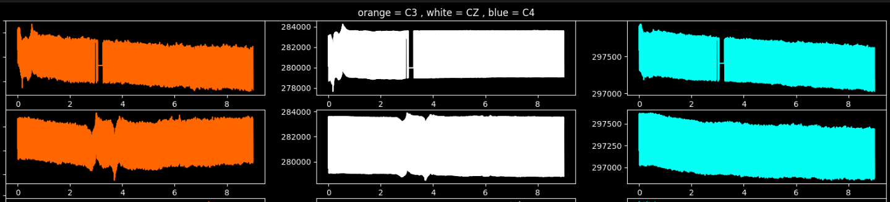
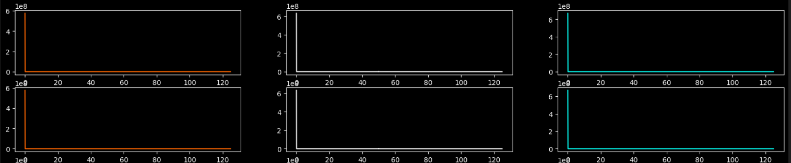
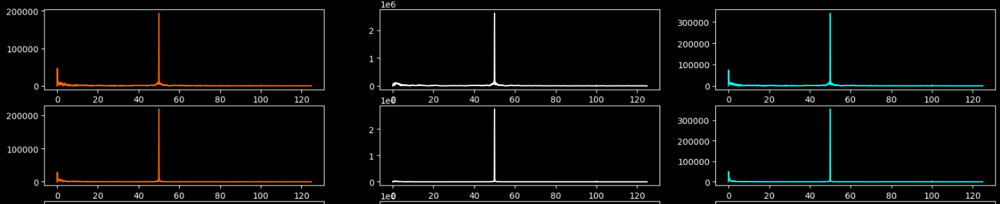
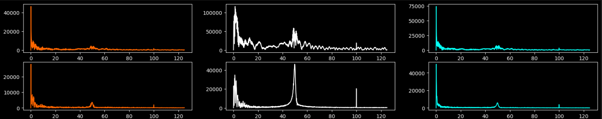
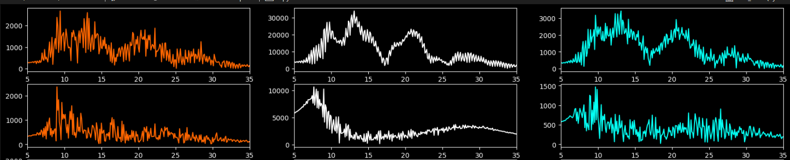
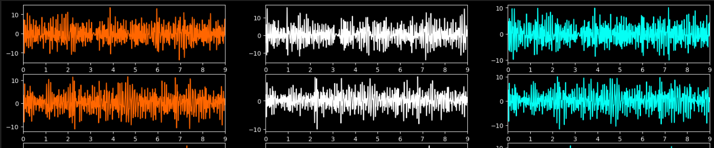

# EEG-SSVEP-and-MI-Classifier


This repository contains the official submission of the **MindCloud** team for the **MTC-AIC 3** competition. It includes all the source code, documentation, and model checkpoints for our EEG signal classifier designed for both SSVEP and MI tasks.

## Installation

### Clone the repository
```bash
git clone git@github.com:AbdelrahmanAmgad201/EEG-SSVEP-and-MI-Classifier.git
cd EEG-SSVEP-and-MI-Classifier
```

## Preprocessing
### MI (Motor Imagery)
Extensive research and analysis led us to select the C3, C4, and Cz channels for the Motor Imagery (MI) task, as these electrodes are closely associated with sensorimotor activity in the brain and are known to capture MI-related signals effectively.

Raw Data:

The preprocessing pipeline involved several critical steps to ensure clean and informative EEG data:

### Frequency Domain Transformation
The raw EEG signals were transformed into the frequency domain using the Fast Fourier Transform (FFT). This allowed us to better isolate and process relevant frequency components.

### DC Offset Removal
To eliminate the baseline drift, we subtracted the mean (DC component) from each channel, effectively centering the signals.

### Notch Filtering (48–52 Hz)
A notch filter was applied in the 48–52 Hz range to suppress power-line interference and eliminate electrical noise commonly present in EEG recordings.

### Band-Pass Filtering (8–30 Hz)
We applied a band-pass filter to isolate the 8–30 Hz frequency band, which includes the mu (8–12 Hz) and beta (13–30 Hz) rhythms—key frequency components associated with motor imagery activity.

### Artifact Removal using ICA
Independent Component Analysis (ICA) was used to identify and remove artifacts such as muscle activity, and other noise sources. This significantly improved the signal quality and helped retain only the neural components relevant to the MI task.
### Final Preprocessed Signal in time domain :


### SSVEP (Steady State Visually Evoked Potential)

## Chosen Architecture
### MI (Motor Imagery)
We evaluated a wide range of model architectures for the MI classification task, ranging from deep learning approaches such as Conformer-based models to traditional machine learning algorithms. However, given the relatively small dataset size and the risk of overfitting with deep models, we opted for a more robust and interpretable machine learning pipeline.

Final Ensemble Architecture
The chosen architecture was an ensemble classifier using soft voting, combining the outputs of the following models:

Random Forest Classifier
An ensemble of decision trees that provides strong performance on high-dimensional, structured data. It is robust to noise and overfitting, especially useful when features are extracted from EEG signals.

XGBoost
A powerful gradient-boosted tree model known for its speed and regularization capabilities. It handles noise and outliers well and adds diversity to the ensemble.

Support Vector Machine (SVM)
A kernel-based classifier that excels in separating high-dimensional feature spaces with clear margins. It complements the tree-based models by providing a different decision boundary perspective.

### SSVEP (Steady State Visually Evoked Potential)
## Results
## Challenges
Throughout the development of our EEG classifier for both SSVEP and Motor Imagery (MI) tasks, we encountered several challenges that shaped our design decisions:
- Limited Dataset Size
One of the most critical limitations was the relatively small size of the available dataset. This made it difficult to train complex deep learning models without overfitting.
- Limited Number of EEG Channels
The EEG data was recorded using a limited number of channels, which constrained the spatial resolution and reduced the ability to fully capture underlying brain activity patterns. This required careful channel selection and feature engineering, particularly for tasks like MI where specific regions (e.g., C3, C4, Cz) are crucial.

- Noisy and Artifact-Laden Signals
EEG signals are inherently noisy and prone to various artifacts such as eye movements, muscle activity, and environmental electrical interference. These artifacts significantly degrade classification performance if not handled properly. As discussed in the preprocessing section, artifact removal (especially through ICA) was essential to improving signal quality.

- Model Selection and Complexity Trade-off
Choosing the right model architecture was a key challenge. While deep learning models can capture complex patterns, they often require large datasets and long training times. Striking the balance between model complexity and performance was non-trivial.
## Insights
- Simplicity Works
Through experimentation, we discovered that simpler machine learning models, when paired with high-quality preprocessing, consistently outperformed more complex architectures. Ensemble methods like soft voting with Random Forest, XGBoost, and SVM offered strong results without the overhead and instability associated with deep learning.
- Preprocessing Is Critical
Effective preprocessing turned out to be more impactful than increasing model complexity. Steps like band-pass filtering, notch filtering, and ICA-based artifact removal significantly enhanced the quality of the input features and led to more reliable predictions.

## Other Contributions
### Signal visualiser
We developed a signal visualizer GUI to support data exploration and preprocessing. You can find it [here](https://github.com/AmirKaseb/EEG-GUI)
### SSVEP Simulator
We developed and hosted a real-time SSVEP simulator that can be configured and used for further real-time testing. It is available [here](https://gilded-kitsune-dfc3ec.netlify.app/)
## Future Plans
We have been exploring the possibility of acquiring a EEG signal headset to facilitate real-time testing and improving model accuracy and robustness to reach industry level performance.

## References

